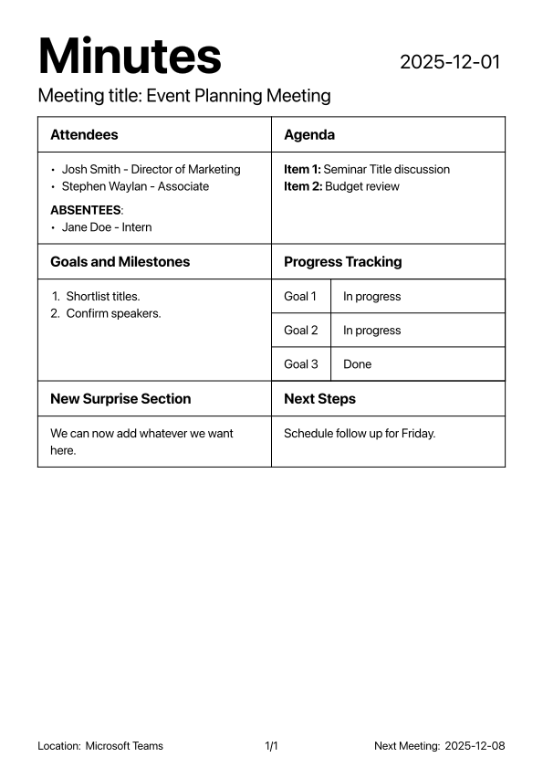

# stylish-minutes - Typst meeting minutes template

A compact, themeable Typst package for nicely styled meeting minutes. (there's a dark theme too!)

<p style="display:flex; gap:12px; align-items:center;">
    
    
</p>

**Installation (global)**

Make sure to have [git installed](https://github.com/git-guides/install-git)

**Linux**
```bash
git clone "https://github.com/nithitsuki/stylish-minutes-typst.git" "${XDG_DATA_HOME:-$HOME/.local/share}/typst/packages/local/stylish-minutes/0.0.1"
```

**macOS**
```bash
git clone "https://github.com/nithitsuki/stylish-minutes-typst.git" ~/Library/Application/typst/packages/local/stylish-minutes/0.0.1
```

**Windows (PowerShell)**
```powershell
git clone "https://github.com/nithitsuki/stylish-minutes-typst.git" "$env:APPDATA/typst/packages/local/stylish-minutes/0.0.1"
```

**Quick Start**

```bash
typst init "@local/stylish-minutes:0.0.1"
```

and enjoy!